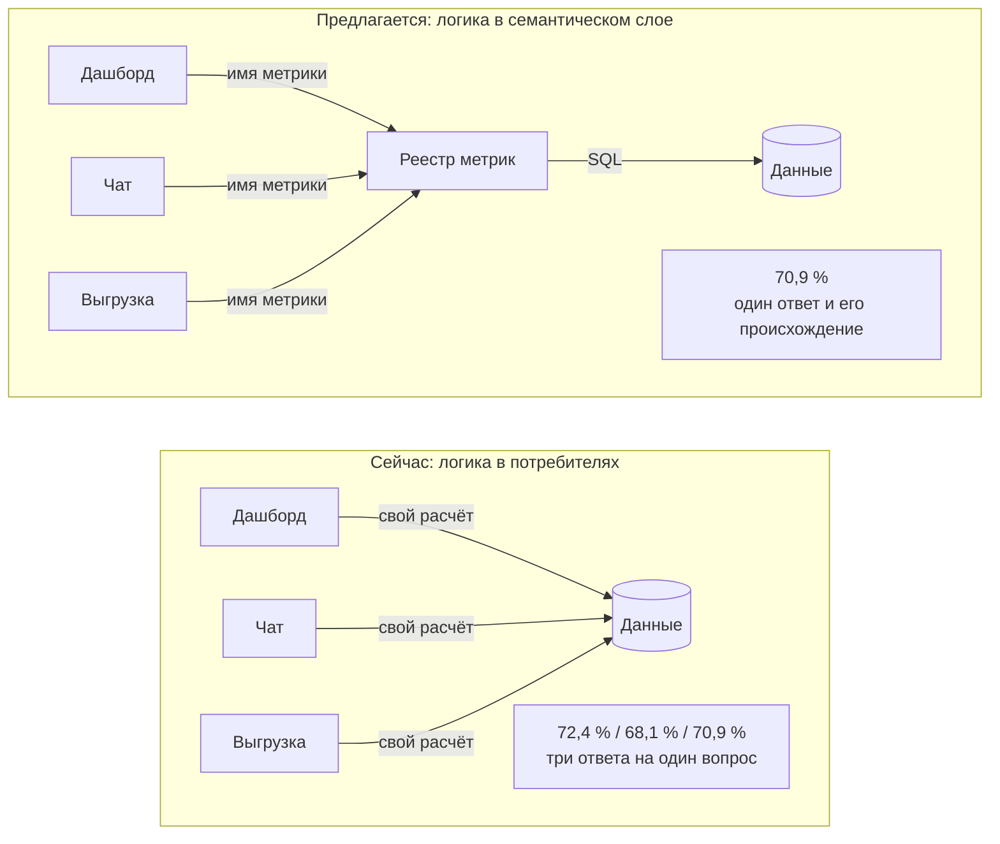
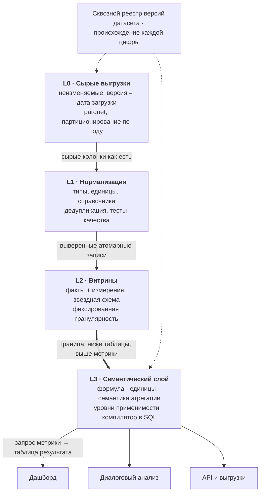
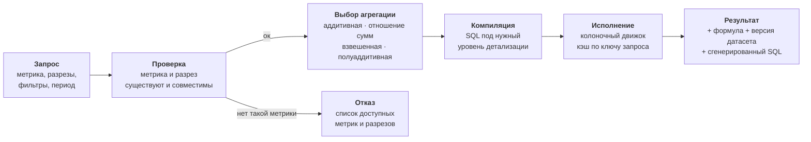
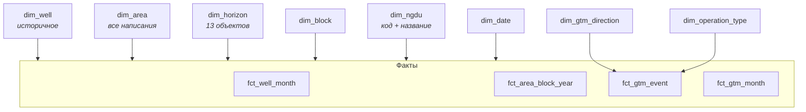
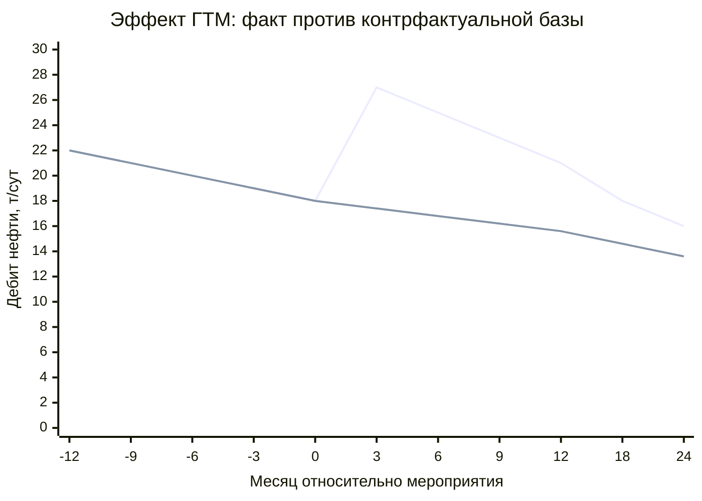

# Техническое задание: платформа анализа разработки месторождения и эффективности ГТМ

**Редакция 1.** Аналитическая система с семантическим слоем метрик как единственным источником
правды: дашборд, диалоговый анализ и выгрузки считают показатели по одному определению
и дают воспроизводимый, защитимый результат.

| | |
|---|---|
| Объект | Многопластовое месторождение, 62 площади, 13 горизонтов |
| Данные | ~10 млн строк «скважина × месяц», 1947–2025 |
| Горизонт работ | 5 этапов, MVP за первые 3 |
| Статус | Черновик для правки |

---

## Содержание

1. [Назначение и цели](#1-назначение-и-цели)
2. [Пользователи и сценарии](#2-пользователи-и-сценарии)
3. [Архитектура](#3-архитектура)
4. [Модель данных](#4-модель-данных)
5. [Семантический слой](#5-семантический-слой)
6. [Методика оценки ГТМ](#6-методика-оценки-гтм)
7. [Функциональные требования](#7-функциональные-требования)
8. [Нефункциональные требования](#8-нефункциональные-требования)
9. [Технологический стек](#9-технологический-стек)
10. [Этапы работ](#10-этапы-работ)
11. [Приёмка](#11-приёмка)

---

## 1. Назначение и цели

Система обслуживает два процесса: контроль за разработкой эксплуатационного объекта
и оценку технологической эффективности геолого-технических мероприятий.

### 1.1. Проблема

В типовых реализациях расчёт показателя живёт внутри кода построения графика. Одна и та же
обводнённость считается по-разному в шапке дашборда, в годовом агрегате и в диалоговом
запросе — и три ответа расходятся. Инженер не может ответить на вопрос «откуда цифра»,
а любое расширение требует копирования формул.

> **Рисунок 1.** Ключевое архитектурное решение. Потребители перестают знать, в какой таблице
> лежит показатель и как он агрегируется: они называют метрику, а реестр компилирует корректный
> запрос. Расхождение между дашбордом и чатом становится невозможным по построению.

### 1.2. Цели

- **Единство расчёта.** Любой показатель имеет ровно одно определение, применяемое всеми потребителями.
- **Воспроизводимость.** Каждое число сопровождается формулой, входными данными и версией датасета;
  отчёт месячной давности пересчитывается один в один.
- **Методическая корректность.** Отношения считаются от сумм, средние — со взвешиванием,
  эффект ГТМ — от контрфактуальной базы, а не от плоского уровня «до».
- **Расширяемость по данным, а не по коду.** Новый показатель или разрез добавляется декларацией,
  без правки экранов.

### 1.3. Границы работ

**Не входит:** экономическая оценка и NPV, гидродинамическое моделирование, интеграция
с системами реального времени, ведение НСИ (справочники принимаются из источника),
геологическое моделирование и интерпретация ГИС.

---

## 2. Пользователи и сценарии

| Роль | Основная задача | Что должен получить |
|---|---|---|
| Технолог ЦДНГ | Контроль состояния фонда и добычи | Отклонения от ожидаемого, список скважин к вмешательству |
| Инженер по разработке | Диагностика выработки, баланс закачки | Характеристики вытеснения, компенсация, состояние заводнения |
| Специалист по ГТМ | Планирование и оценка мероприятий | Эффективность по направлениям, кандидаты, факт против плана |
| Руководитель | Сводная картина, подготовка к совещанию | Динамика ключевых показателей, выгрузка в презентацию |

### Сценарии

1. **Обзор актива.** Что изменилось с прошлого периода, какие площади требуют внимания.
   Не витрина метрик, а перечень отклонений с возможностью провалиться в причину.
2. **Диагностика объекта.** Площадь, блок или горизонт: динамика технологических показателей,
   характеристики вытеснения, баланс закачки, состояние фонда.
3. **Программа ГТМ.** План и факт, эффективность по направлениям и видам операций,
   стратифицированное сравнение, отбор кандидатов.
4. **Карточка скважины.** Полная история: дебиты, обводнённость, давления, мероприятия
   и их эффект на одной оси.
5. **Диалоговый анализ.** Вопрос на естественном языке к тем же метрикам с показом
   выполненного запроса.

---

## 3. Архитектура

Пять слоёв с жёстко определёнными границами. Ключевая граница — между витринами и семантическим
слоем: ниже неё живут таблицы и SQL, выше — только имена метрик и измерений.

> **Рисунок 2.** Слои и контракты между ними. Приложения L4 не имеют доступа к L2 напрямую —
> это архитектурное ограничение, а не соглашение: только через него достигается единство расчёта.

### 3.1. Путь запроса

> **Рисунок 3.** Семантика агрегации выбирается движком по декларации метрики, а не вызывающей
> стороной — поэтому усреднить обводнённость по площадям технически невозможно. Запрос никогда
> не выполняется «примерно похоже на то, что просили».

---

## 4. Модель данных

Звёздная схема. Таблица определяется исключительно своей гранулярностью; смешение уровней
в одной таблице не допускается.

### 4.1. Таблицы фактов

| Таблица | Гранулярность | Порядок строк | Содержание |
|---|---|---|---|
| `fct_well_month` | скважина × месяц | ~10 млн | Добыча, закачка, дебиты, давления, наработка |
| `fct_area_block_year` | площадь × блок × горизонт × год | ~10 тыс | Запасы, фонд, накопленные, компенсация |
| `fct_gtm_event` | одно мероприятие | ~40 тыс | Эффект, база, план, доверительный интервал |
| `fct_gtm_month` | мероприятие × месяц окна | ~1 млн | Факт, контрфактуал, инкремент |

### 4.2. Измерения

> **Рисунок 4.** Измерения выделены в самостоятельные сущности, потому что именно на них ломаются
> наивные реализации: справочник площадей сводит расходящиеся написания один раз, а не в каждом запросе.
> 13 направлений и ~200 видов операций ГТМ — отдельные измерения, а не текстовые атрибуты факта.

### 4.3. Решения, определяющие качество модели

**Скважина как историчная сущность.** Назначение скважины меняется во времени: добывающая
переводится в нагнетательную, встречается совмещённое назначение. Это факт на дату, а не свойство
объекта. Без историчного измерения подсчёт фонда врёт на каждом переводе.

**Сведение площадей.** Наименования площадей в контуре разработки и в учёте мероприятий
расходятся: разный состав, пустые значения, объекты за пределами основного контура. Сопоставление
выполняется в справочнике с явным перечнем несведённых значений.

**Единицы в системе типов.** Обводнённость встречается и в процентах, и в долях; добыча —
в тоннах и в кубометрах. Единица фиксируется как свойство колонки на слое нормализации с явной
конвертацией. Эвристики вида «если значение меньше полутора — умножить на сто» запрещены.

**Запрос «как на дату».** Каждая загрузка получает версию. Запрос выполняется на текущей версии
или на любой прошлой; отчёт сохраняет версию, на которой построен. Это единственный способ
объяснить, почему цифра изменилась после перезагрузки источника.

---

## 5. Семантический слой

Метрика описывается декларацией, а не кодом. Обязательные поля: выражение, единица измерения,
семантика агрегации, допустимые уровни детализации, поведение с пропусками, владелец определения.

### 5.1. Семантика агрегации

Главное поле декларации. От него зависит, какой SQL сгенерирует компилятор при запросе
на конкретном уровне.

| Тип | Правило свёртки | Примеры показателей |
|---|---|---|
| `additive` | Сумма по любому измерению | Добыча нефти, жидкости, воды; закачка |
| `ratio_of_sums` | Отношение агрегатов числителя и знаменателя; **никогда не среднее отношений** | Обводнённость, ВНФ, компенсация, доб/нагн |
| `weighted_avg` | Среднее со взвешиванием по указанному показателю | КИН по геологическим запасам, давление по фонду |
| `semi_additive` | Складывается по объектам, но не по времени — берётся на конец периода | Фонд скважин, остаточные запасы |
| `derived` | Выражается через другие метрики, свёртка наследуется | Темп отбора, динамика год к году, доля в целом |

> **Почему это критично.** Среднее арифметическое обводнённостей площадей не равно обводнённости
> объекта: площадь с суточной добычей в сто раз меньше получает тот же вес. Разница на реальных
> данных достигает единиц процентных пунктов — достаточно, чтобы отчёт разошёлся с промысловым
> и потерял доверие целиком.

### 5.2. Каталог первой очереди

- **Добыча и закачка:** нефть, жидкость, вода, закачка — текущие и накопленные, в массе и объёме.
- **Режимные:** дебиты нефти и жидкости, приёмистость, обводнённость, ВНФ текущий и накопленный,
  коэффициент эксплуатации.
- **Заводнение:** компенсация текущая и накопленная, степень и темп прокачки и промывки,
  соотношение приёмистости к дебиту жидкости.
- **Фонд:** добывающий, нагнетательный, соотношение, ввод и выбытие.
- **Запасы:** КИН, КИЗ, отбор и темп отбора от НИЗ, остаточные извлекаемые.
- **Давления:** пластовое, забойное, депрессия, отношение текущего пластового к начальному.
- **ГТМ:** количество, дополнительная добыча, средний прирост, доля успешных, длительность эффекта.

---

## 6. Методика оценки ГТМ

Эффект мероприятия определяется относительно **контрфактуальной базы** — экстраполяции
естественного падения, а не плоского уровня «до».

Верхняя линия — факт после мероприятия, нижняя — контрфактуал: экстраполяция естественного
падения. **Площадь между линиями за горизонт оценки и есть дополнительная добыча в тоннах.**

> **Рисунок 5.** Плоская база «среднее за три месяца до» дала бы заниженный эффект: она не
> учитывает, что без мероприятия дебит продолжил бы падать. Результат выражается в тоннах
> дополнительной добычи, а не только в приросте дебита, и сверяется с учётной дополнительной
> добычей источника.

### 6.1. Алгоритм

1. **Отбор базового участка.** 12–24 месяца стабильной работы до мероприятия; месяцы с низкой
   наработкой исключаются, показатели нормируются на работающие сутки.
2. **Настройка кривой падения.** Модель Арпса или экспонента с оценкой качества настройки;
   при недостатке точек мероприятие помечается как неоцениваемое, а не считается по умолчанию.
3. **Экстраполяция.** Базовая кривая продолжается на горизонт оценки как «что было бы без мероприятия».
4. **Интегрирование разницы.** Площадь между фактом и контрфактуалом — дополнительная добыча
   в тоннах, с доверительным интервалом от качества настройки.
5. **Длительность эффекта.** Время до падения инкремента ниже порога.
6. **Обработка наложений.** Мероприятия внутри окна оценки разрывают его: эффект относится
   к последнему, предыдущее закрывается досрочно с пометкой.

> **Требование к сопоставимости.** Сравнение эффективности выполняется только на стратифицированных
> группах: по обводнённости до мероприятия, пластовому давлению и горизонту. Сопоставление
> гидроразрыва на обводнённой скважине с гидроразрывом на свежей без нормировки не является
> оценкой эффективности.

Правила базового периода, горизонта оценки и критерия успешности выносятся в конфигурацию.
Система обязана показывать результат по нескольким методикам одновременно, поскольку службы
считают по-разному, и расхождение должно быть объяснимо, а не скрыто.

---

## 7. Функциональные требования

Приоритеты: **MVP** — первая очередь, **2** — вторая очередь, **3** — по мере необходимости.

### 7.1. Загрузка и подготовка данных

| ID | Требование | Пр. |
|---|---|---|
| ФТ-1.1 | Загрузка источников с присвоением версии датасета и сохранением исходных файлов без изменений. *Повторный запуск на той же версии даёт побитово тот же результат* | MVP |
| ФТ-1.2 | Приведение типов, единиц измерения и справочных значений на слое нормализации. *Единица объявлена для каждой числовой колонки* | MVP |
| ФТ-1.3 | Автотесты качества: уникальность ключей, ссылочная целостность, диапазоны, полнота обязательных полей. *Загрузка с непройденными тестами не публикуется* | MVP |
| ФТ-1.4 | Отчёт о качестве загрузки с перечнем несведённых значений справочников и аномалий | 2 |
| ФТ-1.5 | Инкрементальная загрузка новых периодов без полного пересчёта витрин | 2 |

### 7.2. Витрины и модель данных

| ID | Требование | Пр. |
|---|---|---|
| ФТ-2.1 | Таблицы фактов с фиксированной гранулярностью согласно разделу 4 | MVP |
| ФТ-2.2 | Измерения площади, горизонта, блока, НГДУ, календаря; справочник площадей сводит все варианты наименований. *Несведённые значения выносятся в отчёт, а не отбрасываются молча* | MVP |
| ФТ-2.3 | Историчное измерение скважины с сохранением изменений назначения во времени. *Совмещённое назначение обрабатывается явным правилом* | MVP |
| ФТ-2.4 | Измерения направления и вида операции ГТМ | MVP |
| ФТ-2.5 | Запрос данных на произвольную прошлую версию датасета | 2 |

### 7.3. Семантический слой

| ID | Требование | Пр. |
|---|---|---|
| ФТ-3.1 | Реестр метрик в декларативном формате: выражение, единица, семантика агрегации, уровни применимости, обработка пропусков. *Хранится в репозитории, изменение проходит ревью* | MVP |
| ФТ-3.2 | Компилятор запроса «метрика + разрезы + фильтры + период» в SQL с автоматическим выбором свёртки | MVP |
| ФТ-3.3 | Отказ с понятным сообщением при запросе метрики на недопустимом уровне детализации | MVP |
| ФТ-3.4 | Возврат вместе с результатом: формулы, версии датасета и сгенерированного SQL | MVP |
| ФТ-3.5 | Эталонные тесты: значения метрик сверяются с утверждёнными отчётными цифрами. *Расхождение блокирует выпуск* | MVP |
| ФТ-3.6 | Производные метрики: динамика к периоду, темп, доля в целом, накопленные | 2 |

### 7.4. Дашборд

| ID | Требование | Пр. |
|---|---|---|
| ФТ-4.1 | Сценарий «Обзор актива» с перечнем отклонений от ожидаемого | MVP |
| ФТ-4.2 | Сценарий «Диагностика объекта» с разрезами по площади, блоку и горизонту. *Горизонт — полноценное измерение фильтрации, а не атрибут* | MVP |
| ФТ-4.3 | Сценарий «Программа ГТМ»: план и факт, эффективность по направлениям, стратифицированное сравнение | MVP |
| ФТ-4.4 | Карточка скважины: технологические показатели, давления и мероприятия на общей временной оси | 2 |
| ФТ-4.5 | Сквозная фильтрация: выбор объекта на любом элементе применяется ко всему экрану | MVP |
| ФТ-4.6 | Состояние экрана кодируется в адресе страницы. *Ссылка на конкретный срез передаётся коллеге* | MVP |
| ФТ-4.7 | Раскрытие происхождения показателя по клику: формула, входные строки, версия данных | 2 |
| ФТ-4.8 | Характеристики вытеснения с настраиваемым периодом тренда и прогнозом до целевого ВНФ | 2 |
| ФТ-4.9 | Картограмма площадей и блоков по выбранному показателю | 3 |

### 7.5. Оценка ГТМ

| ID | Требование | Пр. |
|---|---|---|
| ФТ-5.1 | Расчёт эффекта от контрфактуальной базы по кривой падения с оценкой качества настройки | MVP |
| ФТ-5.2 | Нормировка показателей на работающие сутки | MVP |
| ФТ-5.3 | Обработка наложения мероприятий в окне оценки | MVP |
| ФТ-5.4 | Параллельный расчёт по нескольким методикам с отображением расхождения. *Включая упрощённую «до/после» для сопоставимости с историческими отчётами* | 2 |
| ФТ-5.5 | Стратифицированное сравнение эффективности по обводнённости, давлению и горизонту | 2 |
| ФТ-5.6 | Сверка расчётной дополнительной добычи с учётной из источника | 2 |
| ФТ-5.7 | Подбор скважин-кандидатов по характеристикам успешных мероприятий | 3 |

### 7.6. Диалоговый анализ

| ID | Требование | Пр. |
|---|---|---|
| ФТ-6.1 | Запрос на естественном языке транслируется в вызов метрики, а не в произвольный SQL. *Модель выбирает из реестра; произвольные выражения не исполняются* | 2 |
| ФТ-6.2 | Пошаговый режим: модель видит результат шага и уточняет запрос | 2 |
| ФТ-6.3 | Отображение выполненного запроса рядом с ответом | 2 |
| ФТ-6.4 | Явный отказ при отсутствии подходящей метрики с перечнем доступных. *Подмена запроса ближайшим похожим не допускается* | 2 |
| ФТ-6.5 | Определения инструментов модели генерируются из реестра метрик автоматически | 2 |

### 7.7. Экспорт и интеграция

| ID | Требование | Пр. |
|---|---|---|
| ФТ-7.1 | Выгрузка любой таблицы и графика в табличный формат с указанием версии данных | MVP |
| ФТ-7.2 | Программный интерфейс запроса метрик со схемой | 2 |
| ФТ-7.3 | Формирование презентационного отчёта по шаблону | 3 |

---

## 8. Нефункциональные требования

| Категория | Требование | Проверка |
|---|---|---|
| Производительность | Отклик запроса метрики на агрегированном уровне — до 1 с, на скважинном — до 5 с | Нагрузочный прогон на полном объёме |
| Производительность | Полный пересчёт витрин — не более 30 мин | Замер на регламентном запуске |
| Корректность | Расхождение с эталонными отчётными значениями — не более 0,1 % | Автотесты на эталонах, блокирующие выпуск |
| Воспроизводимость | Повтор запроса на той же версии данных даёт идентичный результат | Сравнение контрольных сумм |
| Наблюдаемость | Журналирование запросов с метрикой, разрезами, длительностью и версией данных | Ревью журналов |
| Безопасность | Аутентификация пользователей; ограничение частоты и размера запросов к диалоговому модулю | Проверка доступа без учётной записи |
| Безопасность | Секреты только из окружения; отсутствие отключения проверки сертификатов | Аудит конфигурации и кода |
| Сопровождаемость | Добавление метрики не требует изменения кода экранов | Контрольное добавление показателя |
| Развёртывание | Промышленный сервер приложений, контейнеризация, фиксированные версии зависимостей | Сборка из чистого окружения |

---

## 9. Технологический стек

Выбор рассчитан на команду от одного до трёх разработчиков и объём данных порядка
десятков миллионов строк.

| Слой | Решение | Обоснование |
|---|---|---|
| Хранение | Партиционированный parquet | Колоночный формат, версионирование каталогами, не требует сервера |
| Движок | Встраиваемая аналитическая СУБД колоночного типа | Десятки миллионов строк за доли секунды, читает parquet напрямую, разворачивается вместе с приложением |
| Трансформации | Инструмент управления SQL-моделями с тестами и происхождением | Модели как код, декларативные тесты качества, документированное происхождение |
| Семантический слой | Собственный: декларации в репозитории + компилятор в SQL | Для малой команды дешевле и гибче внешнего решения; порядок сотен строк кода |
| Программный интерфейс | Типизированный HTTP-слой с автогенерируемой схемой | Схема служит и документацией, и определением инструментов для диалогового модуля |
| Интерфейс | При питон-команде — серверный фреймворк дашбордов; при наличии фронтенд-ресурса — SPA поверх API | С семантическим слоем экранный код тонкий в обоих вариантах |
| Кэш | Ключ включает версию датасета и версию определения метрики | Исключает выдачу устаревших значений после изменения формулы |

> **Оговорка о сложности.** Полный набор — больше движущихся частей, чем одно приложение
> с прямым чтением файлов. Для одного разработчика допустима сокращённая конфигурация:
> встраиваемая СУБД, реестр метрик и дашборд, без отдельного слоя трансформаций и API.
> Экономить нельзя ровно на одном — на семантическом слое: именно он делает остальное наращиваемым.

---

## 10. Этапы работ

| Этап | Содержание | Срок |
|---|---|---|
| 1. Модель данных и словарь | Гранулярность фактов, состав измерений, единицы, правила сведения справочников, схема версионирования. Результат — согласованный словарь и загруженные витрины с прохождением тестов качества | 2–3 нед |
| 2. Семантический слой и эталоны | Реестр из 15–20 базовых метрик, компилятор, тесты сверки с утверждёнными отчётными цифрами. Здесь закрывается риск методических расхождений — до появления интерфейса | 3–4 нед |
| 3. Первый сценарий целиком | «Обзор актива» от данных до экрана, включая сквозную фильтрацию, состояние в адресе и выгрузку. Проверка на реальных пользователях | 3 нед |
| 4. Модель ГТМ | Контрфактуальная база, нормировка на наработку, обработка наложений, параллельный расчёт по старой методике. Сценарий «Программа ГТМ» | 4 нед |
| 5. Диагностика, скважина, диалоговый анализ | Оставшиеся сценарии и диалоговый модуль поверх готового семантического слоя | 4–5 нед |

**MVP — этапы 1–3:** корректные метрики и один рабочий сценарий.

Диалоговый модуль сознательно вынесен в конец: до появления слоя, к которому он обращается,
он неизбежно начнёт считать по-своему и разойдётся с дашбордом.

---

## 11. Приёмка

Система считается принятой при одновременном выполнении условий:

1. Все метрики каталога первой очереди сходятся с утверждёнными отчётными значениями в пределах
   0,1 % на согласованном наборе контрольных срезов.
2. Дашборд и диалоговый модуль дают идентичный результат на одинаковом запросе — проверяется
   автотестом, а не выборочно.
3. Для любого показателя на экране раскрывается формула, версия данных и выполненный запрос.
4. Повторный запуск загрузки на той же версии источника даёт идентичные витрины.
5. Добавление новой метрики выполняется правкой реестра без изменения кода экранов —
   подтверждается контрольным добавлением в присутствии заказчика.
6. Оценка эффекта ГТМ по новой методике объяснимо соотносится с исторической: расхождения
   разобраны и задокументированы.
7. Выполнены требования по производительности и безопасности из раздела 8.

---

*Документ описывает целевую архитектуру и не привязан к конкретной существующей реализации.
Оценки сроков даны для команды из одного–двух разработчиков при доступности предметного
эксперта для согласования методик.*
